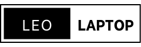

# LeoLaptop – Laptop Shop Management System

<p align="center">
  
</p>

> **LeoLaptop** là một nền tảng thương mại điện tử chuyên biệt cho dòng sản phẩm Laptop, được xây dựng trên hệ sinh thái **Spring Framework**. Dự án áp dụng mô hình **Spring MVC** kết hợp với **JSP** nhằm tối ưu hóa hiệu năng hiển thị và khả năng mở rộng hệ thống, giải quyết bài toán quản lý bán hàng cho các doanh nghiệp quy mô vừa và nhỏ.

---

## 📑 Mục lục
* [🎯 Mục tiêu dự án](#-mục-tiêu-dự-án)
* [🛠️ Công nghệ sử dụng](#-công-nghệ-sử-dụng)
* [🏗️ Kiến trúc hệ thống](#-kiến-trúc-hệ-thống)
* [📦 Các chức năng chính](#-các-chức-năng-chính)
* [🌟 Các tính năng nổi bật](#-các-tính-năng-nổi-bật)
* [🗂️ Cấu trúc thư mục](#-cấu-trúc-thư-mục)
* [🚀 Hướng phát triển](#-hướng-phát-triển-trong-tương-lai)
* [👨‍💻 Tác giả](#-tác-giả)

---

## 🎯 Mục tiêu dự án
- [x] **Kiến trúc chuẩn:** Xây dựng website theo mô hình Layered Architecture (Controller-Service-Repository).
- [x] **Quản trị dữ liệu:** Sử dụng Spring Data JPA để quản lý thực thể và tương tác database MySQL hiệu quả.
- [x] **Bảo mật:** Triển khai cơ chế phân quyền (RBAC) với Spring Security.
- [x] **Trải nghiệm người dùng:** Xây dựng giao diện responsive, thân thiện với người dùng cuối.

---

## 🛠️ Công nghệ sử dụng

### **Core Stack**


### **Frontend & UI**


### **Infrastructure**


---

## 🏗️ Kiến trúc hệ thống
Dự án được thiết kế theo cấu trúc **Layered Architecture** để đảm bảo tính Single Responsibility:
1. **Presentation Layer (JSP & Controller):** Tiếp nhận request và trả về giao diện.
2. **Business Logic Layer (Service):** Xử lý các nghiệp vụ logic, tính toán đơn hàng.
3. **Data Access Layer (Repository):** Sử dụng Spring Data JPA để thao tác với MySQL.
4. **Security Layer:** Bộ lọc Spring Security kiểm soát truy cập trang Admin và User.

---

## 📦 Các chức năng chính

### 🛒 Đối với khách hàng
* **Trang chủ:** Slider nổi bật và danh mục sản phẩm mới nhất.
* **Bộ lọc thông minh:** Tìm kiếm theo hãng (Dell, HP, Apple...), theo tầm giá và cấu hình.
* **Giỏ hàng:** Quản lý số lượng, cập nhật giỏ hàng trực tiếp.
* **Thanh toán:** Quy trình đặt hàng (Checkout) và theo dõi trạng thái đơn hàng.

### 🔐 Đối với quản trị viên (Admin)
* **Dashboard:** Thống kê nhanh số lượng đơn hàng, người dùng và sản phẩm.
* **Quản lý sản phẩm (CRUD):** Thêm mới laptop với đầy đủ thông số kỹ thuật và hình ảnh.
* **Quản lý đơn hàng:** Tiếp nhận, xác nhận hoặc hủy đơn từ khách hàng.
* **Phân quyền người dùng:** Quản lý danh sách tài khoản và cấp quyền truy cập hệ thống.

---

## 🌟 Các tính năng nổi bật
* 🔹 **Bảo mật đa lớp:** Mã hóa mật khẩu BCrypt, chống tấn công CSRF thông qua Spring Security.
* 🔹 **Quản lý file:** Tích hợp tính năng upload hình ảnh sản phẩm lên server chuyên nghiệp.
* 🔹 **Session Management:** Duy trì giỏ hàng ổn định thông qua HTTP Session.
* 🔹 **Responsive Design:** Giao diện hiển thị tốt trên cả Desktop, Tablet và Mobile.

---

## 🗂️ Cấu trúc thư mục
```text
LeoLaptop
├── src/main/java/com/leolaptop
│   ├── config        # Cấu hình Spring Security, JPA
│   ├── controller    # Endpoint điều hướng (Admin & User)
│   ├── domain        # Các thực thể Entity (User, Product, Order...)
│   ├── repository    # Interface JPA Repository
│   ├── service       # Interface & Implementation logic
│   └── util          # Các lớp hỗ trợ (Helper classes)
├── src/main/webapp
│   ├── WEB-INF/views # Chứa các file JSP (layout, admin, client)
│   └── assets        # Tài nguyên tĩnh: CSS, JS, Images
└── pom.xml           # Quản lý dependencies
```

## 🚀 Hướng phát triển trong tương lai

* [ ] Tích hợp cổng thanh toán trực tuyến (VNPay, PayPal).
* [ ] Xây dựng hệ thống gửi email xác nhận đơn hàng tự động.
* [ ] Áp dụng REST API và xây dựng Frontend bằng ReactJS/Angular.
* [ ] Deploy hệ thống lên nền tảng đám mây (AWS/Heroku).

---
